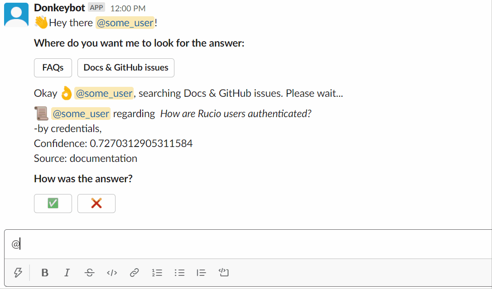

# Donkeybot: Rucio Support Bot with NLP (GSoC Project)


Donkeybot is an end-to-end Question Answering system. It utilizes multiple data sources, an FAQ table and transfer-learning language models like BERT to answer Rucio support questions.

## Introduction

The aim of the project under GSoC 2020 is to use Natural Language Processing (NLP) to develop an intelligent bot prototype able to provide satisfying answers to Rucio users and handle support requests up to a certain level of complexity, forwarding only the remaining ones to the experts.

Donkeybot can be expanded and applied as a Question-Answering system for your needs. Changes in the code are required to use Donkeybot for your specific use case and data. Current implementation applies to Rucio specific data sources.

## What does it do?

1) **Data storage** : A data storage holding Rucio domain-specific data. The module's current implementation is in [SQLite](https://www.sqlite.org/index.html) for the fast prototyping it provides. Data sources include secure and anonymous [support emails](https://rucio.cern.ch/contact.html) from Rucio users, [Rucio GitHub issues](https://github.com/rucio/rucio/issues) and [Rucio documentation](https://rucio.readthedocs.io/en/latest/).
   
2) **Question detection** : A module for question detection and extraction from any given text. This is being used to extract past questions from the support emails and GitHub issues by utilizing regular expressions. These questions are archived as documents and used by the other modules.
   
3) **Document Retrieval** : A search engine module that uses [BM25](https://en.wikipedia.org/wiki/Okapi_BM25) algorithm for the retrieval of the top-n most similar documents ( previously asked questions or Rucio documentation ) to be used as context by the answer detection module.
   
4) **Answer Detection** : The Answer detection module which follows both a transfer-learning approach and a supervised approach. 
   - Using pre-trained transformer models, such as BERT from [Hugginface transformers](https://github.com/huggingface/transformers), to provide the user with the top-k best answers based on the retrieved documents. 
   - FAQ-based supervised approach which helps handle more specific and/or frequent questions with a higher confidence.

**Additional Features** include :

-  **FAQ creation GUI** : User can use a provided GUI as an interface to interact with the data storage, insert FAQ questions, re-index the search engine and expand Donkeybot's knowledge base.

-  **Name hashing** : A script that uses [Stanford's NER tagger](https://nlp.stanford.edu/software/CRF-NER.html) to detect private user information from support emails and hash them. Thus, following CERN's privacy guidelines and keeping all data anonymized. 

## Full Documentation

See the full [documentation](https://github.com/rucio/donkeybot/tree/master/docs) for examples, operational details and other information.

## Google Summer of Code (GSoC)

See [FAQ : GSoC](./docs/faq_gsoc.md) for a detailed timeline, student information, problems faced, future improvement suggestions, a reading list and more.

## Demo 

You can try asking Donkeybot yourself!   
Using the [slackbot](./docs/slackbot.md) : 



Or you can use the CLI:

``` bash
$  python .\scripts\ask_donkeybot.py
```


More examples and information can be found in the [How To Use](./docs/how_to_use.md) section.

## Build

**Step 1:**  A 64 bit [Python 3.x](https://www.python.org/downloads/windows/) installation is required by PyTorch.
   
**Step 2:** To install PyTorch head over to https://pytorch.org/ and follow the quick start guide based on your operating system.  
``` python
# versions used in development 
torch==1.6.0  --find-links https://download.pytorch.org/whl/torch_stable.html
torchvision==0.7.0  --find-links https://download.pytorch.org/whl/torch_stable.html
```

**Step 3:** Clone the repository to your development machine. 
``` bash
$ git clone https://github.com/rucio/donkeybot.git
$ cd donkeybot
```

**Step 4:** For additional requirements run. 
``` bash
$ pip install -r requirements.txt
``` 
    
**Step 5:** Build and populate Donkeybot's data storage. 
``` bash
$ python scripts/build_donkeybot -t <GITHUB_API_TOKEN>
```
- To generate a GitHub token visit [Personal Access Tokens](https://github.com/settings/tokens) and follow [Creating a Personal Access Token](https://docs.github.com/en/github/authenticating-to-github/creating-a-personal-access-token).


See the [Getting Started](./docs/getting_started.md) page for more details on contributing, initiating the developer mode and testing.

## Bugs and Feedback

For bugs, questions and discussions please use the [GitHub Issues](https://github.com/rucio/donkeybot/issues) or contact the student [@mageirakos](https://github.com/mageirakos).

 
## LICENSE

Licensed under the Apache License, Version 2.0;

<http://www.apache.org/licenses/LICENSE-2.0>
