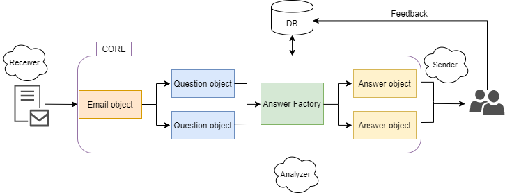
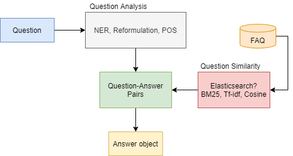

# Architecture 

Final architecture has not been implemented yet.

**Below is a close version of what we are trying to create, of course changes will be made 
and the final version will be updated**

Receiver daemon gets the emails and converts them to the appropriate email object. Once that is received through the Analyzer that uses some question identification algorithm ( regex for start ) to identify and create Question objects that hold whichever metadata we decide. These are run through the Answer Factory which will use multiple methods the Factories to create Answer objects. The Answer object could itself be an Email object that we send back to the user through Sender daemon. Or depending on other metadata that we keep the Answer’s body will be the Email’s body send by Sender. Feedback can then be given by the user on the provided Answer, so that the FAQ table is updated dynamically. 
The DB hold the FAQ table, question+metadata, answers+metadata and past emails.

The Answer Factory is basically the algorithm or algorithms that will be used to identify Answers.
Ideal pipeline: 
* The ‘default’ algorithm that the Bot will use is to utilize the FAQ table created during the analysis period of the project. The architecture of this is shown below. The FAQ can be updated based on user feedback.
* The ‘fallback’ algorithm that the Bot can potentially use is BERT. If an Answer is not found with big enough confidence level, or we cannot match the Question asked to anything we have in our FAQ table we can utilize BERT or other Transformers to try and find an answer through Rucio’s docs. If the answer provided by BERT in this case is correct ( feedback ) we can add it to the FAQ.
* The ‘last resort’ algorithm will basically ‘kick-in’ if no Answer can be found for the Question or the ones found have a bad confidence level where the actual Answer is now to forward the support email to support and/or respond back to the user with some default answer.

On Question Similarity, which is going to be the metrics/algorithms we use to match identified Questions to existing ones in the FAQ we can use several Information Retrieval methods such as the ones mentioned above, or we can even try more advanced Neural Networks, topic models and utilize keyword extraction methods.

Lastly, for the FAQ table creation I suggest we use regex patterns to identify questions, and BERT to identify corresponding answers from the text responses on text bodies where the questions existed. Then after some analysis/validation we can give a confidence score to each answer and pair it with the questions. After user feedback that confidence score can change and question answer pairs also might change accordingly.

