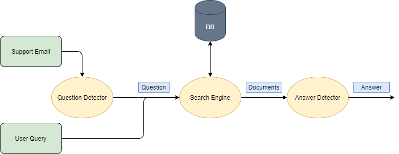

# Contents
- [Contents](#contents)
- [Flow Chart](#flow-chart)
- [Architecture](#architecture)
- [Data Storage](#data-storage)
- [Build Donkeybot](#build-donkeybot)
- [Ask Donkeybot](#ask-donkeybot)
- [Question Detector](#question-detector)
- [Search Engine](#search-engine)
- [Answer Detector](#answer-detector)

# Flow Chart
Here have a flow chart of the question answering interface and what happens when a user queries a question.

# Architecture
Here explain the bots architecture have a pictures that shows how everything links together and what goes into the database

# Data Storage
**1) Support Emails**  Explain that they are secure etc. Look at HOW TO USE for how to use fetch and parse the data.  
**2) GitHub Issues**  Look at HOW TO USE for how to use fetch and parse the data.    
**3) Rucio documentation**    Look at HOW TO USE for how to use fetch and parse the data.  
**3) FAQs** check how to use for adding FAQs etc.   Look at HOW TO USE for how to use fetch and parse the data.  

# Build Donkeybot
Explain build_donkeybot.py script and what it does and that after this is done
the bot's Data Storage is setup (This could go under Data Storage?) or Data Storage could
go under this. Think about it

Probably should go under Architecture??? based on what I'm seeing

# Ask Donkeybot 
Same as above. This could go under Flow Chart or be a standalone thing.

Probably should go under Flow Chart???? based on what I'm seeing

# Question Detector
Question object class diagram?

# Search Engine
Explain what each SearchEngine indexes and how Documents are retrieved

# Answer Detector
Answer object class diagram?

