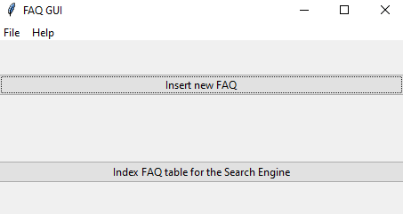
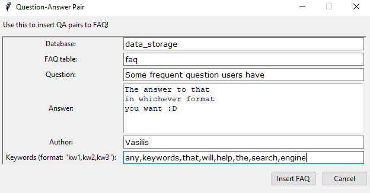
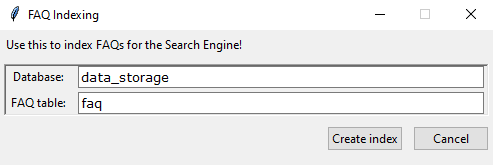
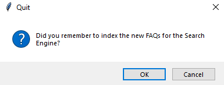

[Move back to documentation homepage](https://github.com/rucio/donkeybot/tree/master/docs)

## Contents
- [Contents](#contents)
- [Outline](#outline)
- [Question Detector](#question-detector)
  - [How can I create a QuestionDetector?](#how-can-i-create-a-questiondetector)
  - [So how does the QuestionDetector work?](#so-how-does-the-questiondetector-work)
  - [What is the difference between IssueQuestion vs EmailQuestion vs IssueCommentQuestion?](#what-is-the-difference-between-issuequestion-vs-emailquestion-vs-issuecommentquestion)
  - [What is this context attribute I'm seeing in the Question objects?](#what-is-this-context-attribute-im-seeing-in-the-question-objects)
  - [Can I use the QuestionDetector for my projects that aren't issue/email/comment related?](#can-i-use-the-questiondetector-for-my-projects-that-arent-issueemailcomment-related)
- [Fetchers](#fetchers)
  - [How can I create a Fetcher ?](#how-can-i-create-a-fetcher-)
  - [How can I fetch GitHub issues?](#how-can-i-fetch-github-issues)
  - [How does Donkeybot Fetch Rucio Documentation?](#how-does-donkeybot-fetch-rucio-documentation)
  - [How does Donkeybot save the fetched data?](#how-does-donkeybot-save-the-fetched-data)
- [Search Engines](#search-engines)
  - [How can I create a Search Engine?](#how-can-i-create-a-search-engine)
  - [How can I query the Search Engine?](#how-can-i-query-the-search-engine)
- [Answer Detector](#answer-detector)
  - [How can I create an AnswerDetector?](#how-can-i-create-an-answerdetector)
  - [How does the AnswerDetecor work?](#how-does-the-answerdetecor-work)
  - [So what data is stored for each answer?](#so-what-data-is-stored-for-each-answer)
  - [What is the difference between the AnswerDetector and the QAInterface?](#what-is-the-difference-between-the-answerdetector-and-the-qainterface)
  - [How can I create a QAInterface?](#how-can-i-create-a-qainterface)
  - [Can I use the AnswerDetector for my projects?](#can-i-use-the-answerdetector-for-my-projects)
- [How can I add FAQs?](#how-can-i-add-faqs)
- [How does Donkeybot handle the text processing needed?](#how-does-donkeybot-handle-the-text-processing-needed)

## Outline

Almost everything in the sections of this page have a corresponding notebook.  
See [examples](https://github.com/rucio/donkeybot/tree/master/examples) for a more hands on guide by looking at the notebooks.

Also, the functionality explained here is what runs 'under the hood' in the [scripts](https://github.com/rucio/donkeybot/tree/master/scripts) which use Donkeybot.   
So instead of explaining those I chose a more straightforward approach and look at the code with easy examples.

## Question Detector

### How can I create a QuestionDetector?

Donkeybot's `QuestionDetector` must be one of the following types : "email", "issue" or "comment"  
This is so that the `QuestionDetector` creates the correct type of Question objects.  
Be it an `EmailQuestion`, `IssueQuestion`, `CommentQuestion`.  

Let's create one for `IssueQuestions`!


```python
from bot.question.detector import QuestionDetector
```


```python
detector = QuestionDetector("issue")
```


```python
text =  """
        What is this 'text', you ask? 
        Well, it's a monologue I'm having... can it help with something you still ask? 
        In testing the QuesitonDetector of course! 
        Did that answer all your questions?
        I sure hope so..."
        """ 
```

### So how does the QuestionDetector work?  
Simply use the .detect() method!    
The results are going to be a list of `Question` objects.    
In this specific example `IssueQuestion` objects.    


```python
results = detector.detect(text)
results
```

    [<bot.question.issues.IssueQuestion at 0x2223974d348>,
     <bot.question.issues.IssueQuestion at 0x2223974d448>,
     <bot.question.issues.IssueQuestion at 0x2223974d908>]

And all 3 questions from the sample text above have been identified!

```python
[(question.question) for question in results]
```
    [ "What is this 'text', you ask?",
      "Did that answer all your questions?",
      "can it help with something you still ask?"]


### What is the difference between IssueQuestion vs EmailQuestion vs IssueCommentQuestion? 

The only difference is their `origin` and how they get their `context` attributes.     

Look at [What is this `context` attribute I'm seeing?](b#What-is-this-context-attribute-I'm-seeing?) for more


```python
results[1].__dict__
```

    {'id': '8621376d766242ab9fd740a3698f0dd2',
     'question': 'Did that answer all your questions?',
     'start': 188,
     'end': 223,
     'origin': 'issue',
     'context': None}


### What is this context attribute I'm seeing in the Question objects?

Well, that's what the AnswerDetector uses to try and answer each question!  

~To be more specific~

1) When a new User Question is asked and is very similar or identical to the questions archived by using the .detect() method.   
2) Then the context of these archived questions is used as context for the new User Question.   
3) Donkeybot's AnswerDetector tries to find suitable answers!  

For `IssueQuestions` the context are any comments that are part of the same GitHub issue.  
For `IssueCommentQuestion` the context are comments after this specific one where the Question was detected.  
For `EmailQuestions` the context are the bodies of the reply emails to the email where the Question was detected.

Each different Question object has it's own unique `find_context_from_table()` 
method that sets the attribute by following the logic explained above.   

Basically go into the table in our Data Storage and SELECT the context we want.

### Can I use the QuestionDetector for my projects that aren't issue/email/comment related?

Yes!     

But, if you aren't following the issue, email, comment logic Donkeybot follows at the point of writing this.
(end of GSoC '20').    

Then, Donkeybot needs to be expanded to have a `Question` superclass and a `set_contexT()` method fo you to simple set the context without going into some dependand Data Storage.    

If you want to see this in Donkeybot [open an issue](https://github.com/rucio/donkeybot/issues) and suggest it.
I'll see that you've been reading the documentation and that this functionality is needed :D 


## Fetchers

The scripts `fetch_issues.py`, `fetch_rucio_docs.py` do everything explained here. 
See [scripts](https://github.com/rucio/donkeybot/tree/master/scripts) for source code and run the scripts with the '-h' option for info on the arguments they take.  
eg.  

`(virt)$ python scripts/fetch_rucio_docs.py -h`


### How can I create a Fetcher ?

Simple, use the `FetcherFactory` and just pick the fetcher type 
- Issue for a GitHub `IssueFetcher`
- Rucio Documentation for a `RucioDocsFetcher`   

What about the `EmailFetcher` ?
- Currently as explained in [How It Works](https://github.com/rucio/donkeybot/blob/master/docs/how_it_works.md) emails are fetched from different scripts run in CERN and not through Donkeybot.


```python
from bot.fetcher.factory import FetcherFactory
```

Let's create a GitHub `IssueFetcher`.

```python
issues_fetcher = FetcherFactory.get_fetcher("Issue")
issues_fetcher
```
    <bot.fetcher.issues.IssueFetcher at 0x1b75c30b6c8>

### How can I fetch GitHub issues?

You need 4 things.
- The **repository** whose issues we are fetching
- A **GitHub API token**. To generate a GitHub token visit [Personal Access Tokens](https://github.com/settings/tokens) and follow [Creating a Personal Access Token](https://docs.github.com/en/github/authenticating-to-github/creating-a-personal-access-token).
- The **maximum number of pages** the fetcher will look through to fetch issues. (default is 201)
- A couple pandas **DataFrames**, one which will hold the issues data and one for the issue comments data.


```python
import pandas as pd
```


```python
repository = 'rucio/rucio' # but you can use any in the format user/repo
token = "<YOUR_TOKEN>"
max_pages = 3
```


```python
(issues_df, comments_df) = issues_fetcher.fetch(repo=repository, api_token=token, max_pages=max_pages)
```

The resulting DataFrames will look like this:


```python
issues_df.info()
```

    <class 'pandas.core.frame.DataFrame'>
    RangeIndex: 26 entries, 0 to 25
    Data columns (total 7 columns):
     #   Column      Non-Null Count  Dtype 
    ---  ------      --------------  ----- 
     0   issue_id    26 non-null     object
     1   title       26 non-null     object
     2   state       26 non-null     object
     3   creator     26 non-null     object
     4   created_at  26 non-null     object
     5   comments    26 non-null     object
     6   body        26 non-null     object
    dtypes: object(7)
    memory usage: 1.5+ KB
    


```python
comments_df.info()
```

    <class 'pandas.core.frame.DataFrame'>
    RangeIndex: 16 entries, 0 to 15
    Data columns (total 5 columns):
     #   Column      Non-Null Count  Dtype 
    ---  ------      --------------  ----- 
     0   issue_id    16 non-null     object
     1   comment_id  16 non-null     object
     2   creator     16 non-null     object
     3   created_at  16 non-null     object
     4   body        16 non-null     object
    dtypes: object(5)
    memory usage: 768.0+ bytes
    


### How does Donkeybot Fetch Rucio Documentation? 

It's the same process we followed with the `IssueFetcher` only now the factory will create a `RucioDocsFetcher`


```python
from bot.fetcher.factory import FetcherFactory
```


```python
docs_fetcher = FetcherFactory.get_fetcher("Rucio Documentation")
docs_fetcher
```


    <bot.fetcher.docs.RucioDocsFetcher at 0x1b75c43bf48>


```python
token = "<YOUR_TOKEN>"
```


```python
docs_df = docs_fetcher.fetch(api_token=token)
```


### How does Donkeybot save the fetched data?

For this we need to  
**Step 1.** open a connection to our Data Storage  


```python
from bot.database.sqlite import Databae

# open the connection
db_name = 'data_storage'
data_storage = Database(f"{db_name}.db")
```

**Step 2.** Save the fetched issues and comments data.


```python
# save the fetched data
issues_fetcher.save(
    db=data_storage,
    issues_table_name='issues',
    comments_table_name='issue_comments',
)
```

**Step 2.1.** Alternativerly save the documentation data.


```python
# save the fetched data
docs_fetcher.save(db=data_storage, docs_table_name='docs')
```

**Step 3.** Finally close the connection


```python
# close the connection
data_storage.close_connection()
```

**Alternative :** If you don't want to use Donkeybot's Data Storage you can use the `save_with_pickle()` and `load_with_pickle()` methods to achieve the same results.

## Search Engines

You can use the script `query.py` to query the search engines and  `create_se_indexes.py` is what creates the Search Engine
indexes for Donkeybot. 
See [scripts](https://github.com/rucio/donkeybot/tree/master/scripts) for source code and run the scripts with the '-h' option for info on the arguments they take.  
eg.  

`(virt)$ python scripts/query.py -h`

### How can I create a Search Engine?

There are 3 types of Search Engines in Donkeybot at the moment:  
- `SearchEngine` which is used to query general documenation ( in our case Rucio Documentation )  
- `QuestionSearchEngine` which is used to query Question objects saved in Data Storage  
- `FAQSearchEngine` which is used to query FAQs saved in Data Storage  

Let's create a `QuestionSearchEngine`


```python
from bot.searcher.question import QuestionSearchEngine
```


```python
qse = QuestionSearchEngine()
qse
```


    <bot.searcher.question.QuestionSearchEngine at 0x2a2cf58a348>


**The QuestionSearchEngine is not yet usable!**    

We need 3 things:   

**Step 1.** Have a pandas **DataFrame** with the column **question** that holds the information we will index. The document id for th QuestionSearchEngine will be a column named **question_id** under corpus.   

*sidenote*: A nice addition to Donkeybot will be the ability to change the name of these columns and have something more general.  
But, this is only needed for the sqlite implementation. If in the future we move to Elasticsearch there is no need.

**Step 2.** Have an open connection to the Data Storage

**Step 3.** `create_index()` or `load_index()` which is the document term matrix of the questions.


```python
# Step 1
import pandas as pd
# example DataFrame
corpus_df = pd.DataFrame({"question_id": [0,1,2,3],
                          "question":["What happened in GSoC 2020 ?",
                                      "How can I create an index ?",
                                      "How can I load an index ?", 
                                      "Why are there so many questions in this example?"], 
                          "answer":["Donkeybot was created!", 
                                    "With the .create_index() method!",
                                    "With the .load_index() method!",
                                    "Because BM25 need enough data to create good tf-df vectors :D"]})
corpus_df
```


```python
# Step 2
from bot.database.sqlite import Database
data_storage = Database('your_data_storage.db')
```


```python
# Step 3 create the index!
qse.create_index(
        corpus=corpus_df, db=data_storage, table_name="corpus_doc_term_matrix"
    )
qse.index
```


```python
data_storage.close_connection()
```

Now the QuestionSearchEngine is ready!

### How can I query the Search Engine?

Let's try and query the `QuestionSearchEngine` we just created above


```python
query = "Anything cool that happened in this year's GSoC?" # whatever you want to ask
top_n = 1 # number of retrieved documents 
```

And just run the `.search()` method.


```python
qse.search(query, top_n)
```


This is pretty much the logic of the FAQ table which holds Question and Answer pairs.

## Answer Detector

### How can I create an AnswerDetector?

It's very simple, just call the constructor!  


```python
from bot.answer.detector import AnswerDetector
```


```python
answer_detector = AnswerDetector(model='distilbert-base-cased-distilled-squad',
                                 extended_answer_size=30,
                                 handle_impossible_answer=True,
                                 max_answer_len=20,
                                 max_question_len=20,
                                 max_seq_len=256,
                                 num_answers_to_predict=3,
                                 doc_stride=128,
                                 device=0)
```

**What do all these paremeters mean?**

Well if you want to go deeper you can always look at the [Source Code](https://github.com/rucio/donkeybot/blob/master/lib/bot/answer/detector.py).   

The important parameters for now are : 
- **model :**  name of the transformer model used for QuestionAnswering.
- **num_answers_to_predit :** Number of answers that are predicted for each document that the AnswerDetector is given.    

Remember these documents are the ones retrieved by each Search Engine so a lot of answers are predicted until top_k are returned.   

### How does the AnswerDetecor work?

**Step 1.** Have a **question**.   

**Step 2.** Have some **documents** in which the answer might reside in.    

**Step 3.** Make sure those documents are in a pandas **DataFrame** and the context used for answer detection is under the "context" column.

As of right now there is no option to simply use the AnswerDetector with strings.  
For Donkeybot which uses different datasources we decided to utilize pandas DataFrames.  
Donkeybot can always be expanded if the functionality is required.  


```python
import pandas as pd
```


```python
question = "What is the aim of Donkeybot?" 

documents = pd.DataFrame({
    "context" : ["""
                The aim of the Donkeybot project under GSoC 2020 is to use Native Language Processing (NLP) 
                to develop an intelligent bot prototype able to provide satisfying answers to Rucio users 
                and handle support requests up to a certain level of complexity, 
                forwarding only the remaining ones to the experts.
                """,
                """
                Different levels of expert support are available for users in case of problems. 
                When satisfying answers are not found at lower support levels, a request from a user or a group 
                of users can be escalated to the Rucio support. Due to the vast amount of support requests, 
                methods to assist the support team in answering these requests are needed.
                """],
    "col_2" : ["first_doc", "second_doc"],
    "col_3" : ["other", "data"]
})
```


```python
answers = answer_detector.predict(question, documents, top_k=2)
```

So asking `What is the aim of Donkeybot?`, providing the above documents and asking for 2 answers gives us:


```python
print(question)
[(f"answer {i+1}: {answer.answer} | confidence : {answer.confidence}") for i,answer in enumerate(answers)]
```

    What is the aim of Donkeybot?
    ['answer 1: assist the support team | confidence : 0.44691182870541724',
     'answer 2: to use Native Language Processing (NLP) | confidence : 0.24011110691572668']


### So what data is stored for each answer?


```python
answers[1].__dict__
```

    {'id': 'c3e44f0799b645c9b690f98e4b5e07ea',
     'user_question': 'What is the aim of Donkeybot?',
     'user_question_id': '2fc28e8f32',
     'answer': 'to use Native Language Processing (NLP)',
     'start': 69,
     'end': 125,
     'confidence': 0.24011110691572668,
     'extended_answer': 'ot project under GSoC 2020 is to use Native Language Processing (NLP) \n                to develop an intelligent bot',
     'extended_start': 39,
     'extended_end': 155,
     'model': 'distilbert-base-cased-distilled-squad',
     'origin': 'questions',
     'created_at': '2020-08-26 18:08:08+00:00',
     'label': None,
     'metadata': {'col_2': 'first_doc', 'col_3': 'other'}}


See [How it Works](https://github.com/rucio/donkeybot/blob/master/docs/how_it_works.md) where we cover the same information and explain in more detail.

### What is the difference between the AnswerDetector and the QAInterface? 

Basically the QAInterface under `brain.py` of Donkeybot, glues together all `SearchEngines` nd the  `AnswerDetector`.   

It is the interface used in `ask_donkeybot.py` script. Take a look at the [Source Code](https://github.com/rucio/donkeybot/blob/master/scripts/ask_donkeybot.py) for more information.

### How can I create a QAInterface?

Given that you have correctly created:
- `AnswerDetector`
- `SearchEngine` 
- `QuestionSearchEngine` 
- `FAQSearchEngine`   

All correctly.

Then simply load the interface


```python
from bot.brain import QAInterface
```


```python
# load interface
qa_interface = QAInterface(
    detector=answer_detector,
    question_engine=question_se,
    faq_engine=faq_se,
    docs_engine=docs_se,
)
```

### Can I use the AnswerDetector for my projects?

Yes, but it probably will require some tweaking and if you aren't using Donkeybot for setting up and curating your data then it might not be worth it.   

Simply look under the hood and use Transformer pipelines for your needs.

## How can I add FAQs?
The easiest way to do this is to use the *very* simple GUI Donkeybot provides.

**All you need to remember is:**  
Always re-index the FAQ table after adding new FAQs.    
Otherwise, the FAQSearchEngine won't see them.  


**Main Window**  
You'll see the window's logic follows the 2 step process for adding any new data that the Search Engines needs to query.



**Step 1.** Insert new FAQ.  



**Step 2.** Re-index the FAQ table with the new data.    

Just make sure that the Database and FAQ table are the same in both cases.




Donkeybot will remind you to re-index in case you forget what the docs suggest 😊



## How does Donkeybot handle the text processing needed? 

With the help of libraries like [string](https://docs.python.org/2/library/string.html), [datetime](https://docs.python.org/3/library/datetime.html), [pytz](https://pypi.org/project/pytz/) and [nltk](https://www.nltk.org/) 😁 

See [bot.utils](https://github.com/rucio/donkeybot/blob/master/lib/bot/utils.py) module for the text-processing source code.


[Move back to documentation homepage](https://github.com/rucio/donkeybot/tree/master/docs)
